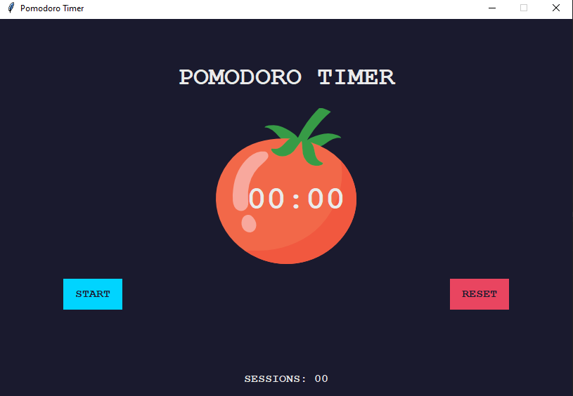

# Pomodoro Timer

A desktop Pomodoro timer built with Python and Tkinter to help improve focus and productivity using the Pomodoro Technique. The application alternates between work sessions and break periods while displaying a visual countdown and progress indicator.

---

## Screenshots

### Main Window



---

## Features

- Pomodoro work and break timer
- Automatic session transitions
- Countdown timer
- Visual progress indicator
- Start and reset functionality
- Session tracking with check marks
- Simple and intuitive user interface

---

## Technologies Used

- Python
- Tkinter
- Object-Oriented Programming (OOP)

---

## Project Structure

```
PomodoroApp/
│
├── main.py
└── screenshots/
```

---

## How It Works

The Pomodoro Technique divides work into focused intervals followed by short breaks.

Typical workflow:

1. Start a **25-minute** work session.
2. Take a **5-minute** short break.
3. Repeat the cycle.
4. After every four work sessions, take a **20-minute** long break.

The application automatically switches between sessions and keeps track of completed work intervals.

---

## Skills Demonstrated

- GUI development with Tkinter
- Event-driven programming
- Timer scheduling using `after()`
- State management
- Countdown implementation
- User interface design
- Application flow control

---

## Future Improvements

- Customizable work and break durations
- Pause and resume functionality
- Desktop notifications
- Sound alerts
- Daily productivity statistics
- Dark mode
- Session history
