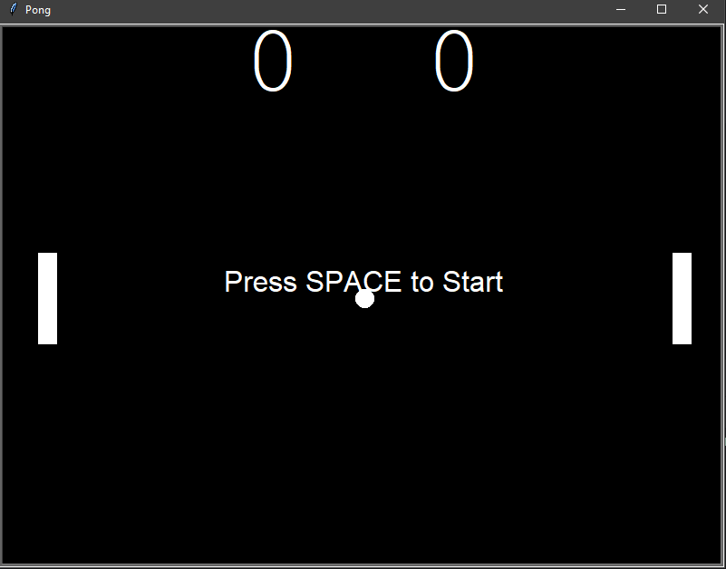
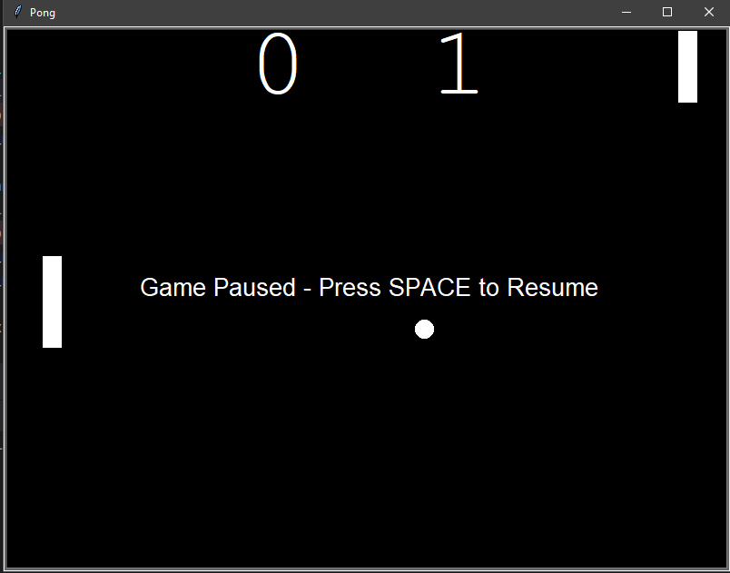

# Pong Game

A classic two-player Pong game built with Python using the Turtle graphics library. Players control paddles to bounce the ball back and forth while trying to score points by getting the ball past their opponent.

---

## Screenshots

### Gameplay






---

## Features

- Two-player gameplay
- Real-time keyboard controls
- Ball collision detection
- Paddle collision mechanics
- Automatic score tracking
- Ball speed increases after paddle collisions
- Automatic ball reset after each point
- Winning score detection

---

## Controls

| Player | Keys |
|---------|------|
| Left Paddle | `W` / `S` |
| Right Paddle | `↑` / `↓` |

---

## Technologies Used

- Python
- Turtle Graphics
- Object-Oriented Programming (OOP)

---

## Project Structure

```
PongGame/
│
├── main.py
├── paddle.py
├── ball.py
├── scoreboard.py
└── screenshots/
```

---

## Game Rules

1. Two players compete by controlling their paddles.
2. Prevent the ball from passing your paddle.
3. Each successful pass scores one point for the opposing player.
4. The ball resets after every point.
5. The game continues until the winning score is reached.

---

## Skills Demonstrated

- Object-Oriented Programming
- Event-driven programming
- Collision detection
- Game loop implementation
- Keyboard event handling
- Score management
- Modular project architecture

---

## Future Improvements

- Single-player mode with AI opponent
- Adjustable difficulty levels
- Sound effects
- Pause and restart functionality
- Main menu
- High score persistence
