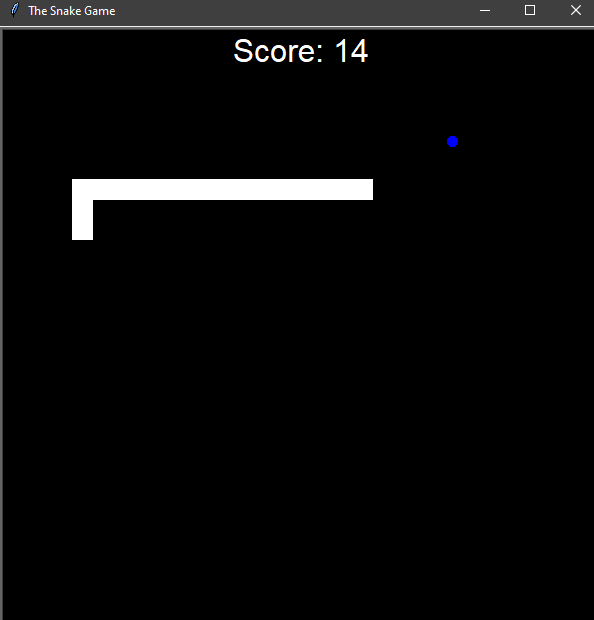

# Snake Game

A classic Snake game built with Python using the Turtle graphics library. Control the snake, collect food to grow, and avoid collisions with the walls or your own body.

---

## Screenshots

### Gameplay




---

## Features

- Classic Snake gameplay
- Score tracking
- Snake grows after eating food
- Random food generation
- Collision detection with walls
- Self-collision detection
- Automatic game over
- Simple keyboard controls

---

## Controls

| Key | Action |
|------|--------|
| W | Move Up |
| S | Move Down |
| A | Move Left |
| D | Move Right |

---

## Technologies Used

- Python
- Turtle Graphics
- Object-Oriented Programming (OOP)

---

## Project Structure

```
Snake Game/
│
├── main.py
├── snake.py
├── food.py
├── scoreboard.py
└── screenshots/
```

---

## Game Rules

1. Use the arrow keys to control the snake.
2. Eat food to increase your score.
3. Each piece of food makes the snake grow longer.
4. Avoid colliding with the walls.
5. Avoid colliding with the snake's own body.
6. The game ends when a collision occurs.

---

## Skills Demonstrated

- Object-Oriented Programming
- Event handling
- Collision detection
- Game loop implementation
- Random object generation
- State management
- Modular project structure

---

## Future Improvements

- High score persistence
- Difficulty levels
- Pause and resume functionality
- Sound effects
- Better graphics and animations
