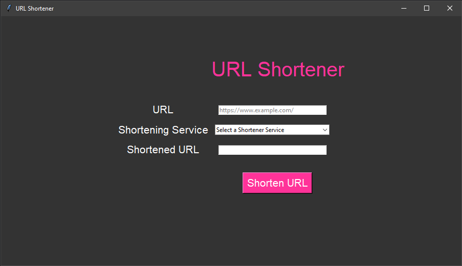
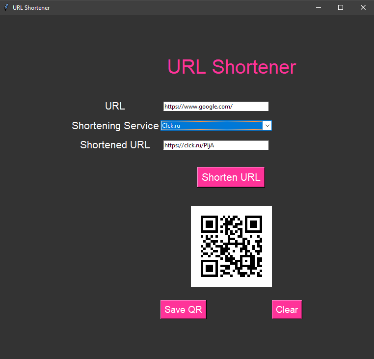

# URL Shortener with QR Code Generator

A Python desktop application that shortens URLs using multiple services and generates QR codes.

## Features

- 7 different URL shortening services
- QR code generation
- One-click copy to clipboard
- Save QR codes as images
- Clean, modern UI
- Error handling exceptions

## Technologies Used

- Python 3.x
- Tkinter (GUI)
- pyshorteners (URL shortening)
- qrcode (QR generation)
- Pillow (Image handling)

## How to Run

1. Install dependencies: `pip install pyshorteners qrcode pillow pyperclip`
2. Run: `python main.py`

## Screenshots

### Startup

### After URL Shortening

